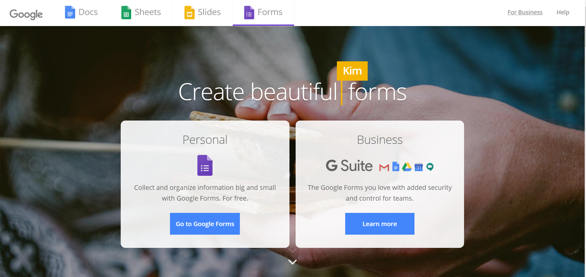
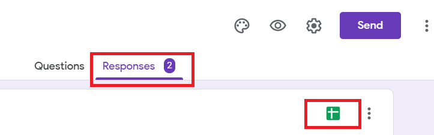
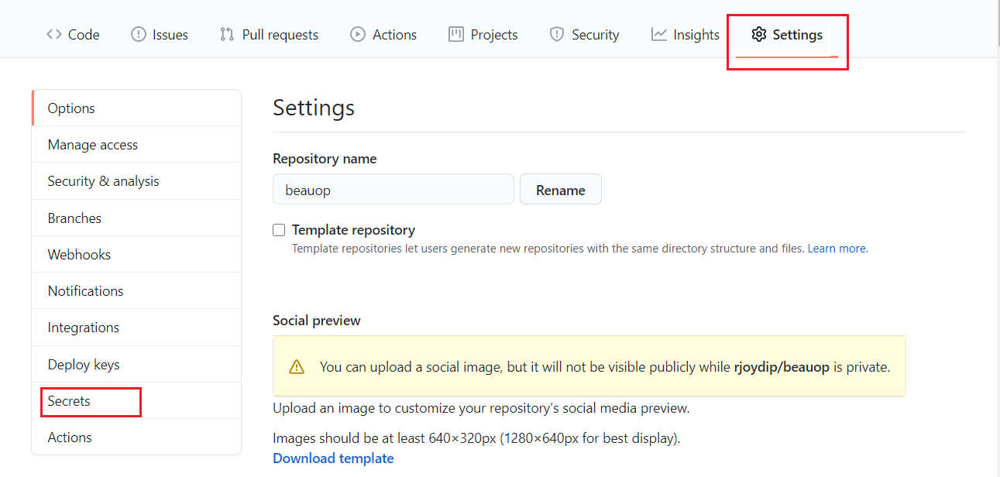

# beauop

Automatic event blog publisher by the help of google form and sheet.

## Steps

- Create a google form

    

- Link form to googlesheet

    Go to `response` of the created form and link with googlesheet.

    

- Publish googlesheet to public

    **File > Publish to the Web > Publish**

- Copy google sheet ID

    Copy the id between /spreadsheets/ and /edit in the url: <https://docs.google.com/spreadsheets/d/1fvz34wY6phWDJsuIneqvOoZRPfo6CfJyPg1BYgHt59k/edit>

- Clone/Fork repository and add googlesheet ID

    First clone or fork the repository and add google sheet id in secrets. The key should be `SHEET_ID`. This is required for [googlesheet-actions](https://github.com/marketplace/actions/googlesheet-actions)

    

## How beauop works

- When new event posted through `google form` it update googlesheet.
- Other side in every 5 mins data collects from googlesheet (as json) by the help of [googlesheet-actions](https://github.com/marketplace/actions/googlesheet-actions).
- Once it's `googlesheet-actions` finds new data it update `data.json` and build workflow triggred on every push.
- After that vercel deployed the site.

## FAQ

- There might be a case where first row will be empty in googlesheet. Plese remove the empty row.
- There is no empty data checks.
- If all fields are optional in `google form` in that case only timestamp will generate.
- There is no encryption mechanisam available right now.
